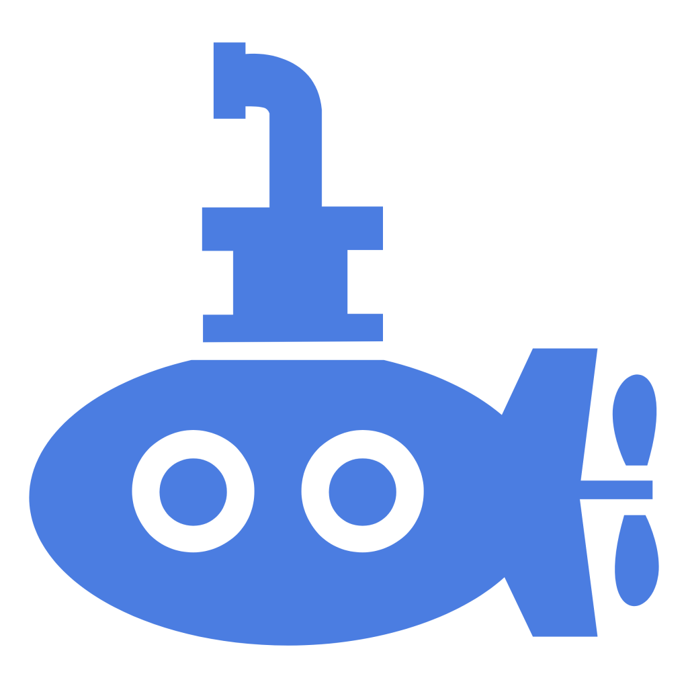
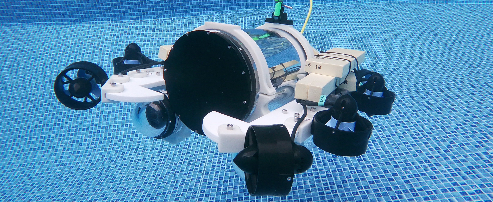
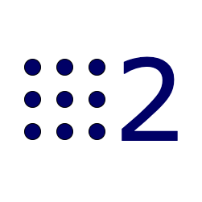
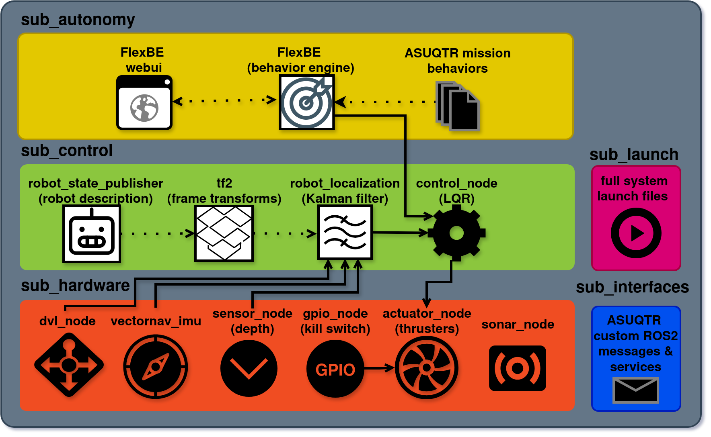
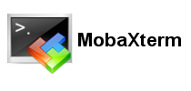
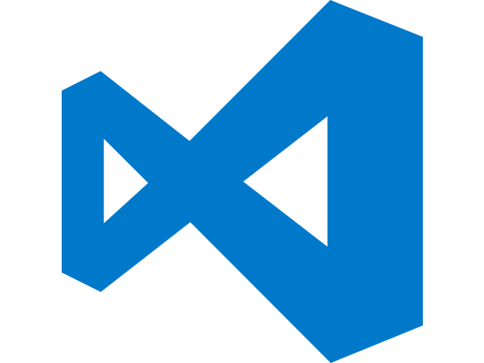

# ASUQTR ROS 2 Workspace

<p align="center">
  
</p>

Welcome to the core ROS 2 workspace for the ASUQTR submarine. This repository contains install scripts to deploy ASUQTR software infrastructure, the entire ASUQTR source code (hardware drivers & control math (LQR), autonomous behaviors, etc.) and system-level launch configurations.

## Layered Software Architecture
ASUQTR's ROS2 software architecture contains 5 ROS2 packages, following a typical layered architecture patern :
> [!TIP]
> Click the sub package links to go to their README.md and get further details and specifications
* [`sub_hardware`]()
* [`sub_control`]()
* [`sub_autonomy`]()
* [`sub_interfaces`]()
* [`sub_launch`]()


In the following architecture diagram, __BLACK__ icons are ASUQTR nodes/custom code, while __WHITE__ icons are standard ROS2 packages.

<a target="_blank">
  
</a>


## System Deployment
To ensure consistency across the team and the physical robot, this project is fully containerized using Docker, with built-in support for the ASUQTR Web Dashboard via `rosbridge`.

---

## <a id="ssh"></a>🔌 0. Connect to the Jetson Xavier (SSH)

Before running any scripts or containers on the physical submarine, you must log into the Jetson Xavier with your laptop with either of :

### MobaXterm (Common for Windows users) :
<a href="https://mobaxterm.mobatek.net/download.html" target="_blank">
  
</a>

1. Open MobaXterm and click **Session** -> **SSH**.
2. Enter the Jetson's IP address (e.g., `192.168.x.x`) in the "Remote host" field.
3. Specify the Jetson's username (`asuqtr`), click **OK**, and enter the password (`asuqtr123`) when prompted.

### VS Code (Recommended)
<a href="https://code.visualstudio.com/download" target="_blank">
  
</a>

While you can write code in basic editors from MobaXterm,, the best developer experience is to attach Visual Studio Code directly to the running ROS 2 Docker container.

1. Install the `Remote - SSH` and `Docker` extensions in your local VS Code.
2. Use the `Remote - SSH` extension to connect to the Jetson (`ssh asuqtr@<JETSON_IP>`) Password is `asuqtr123`.
3. __(If containers already started)__ Open the `Docker` extension tab in the left sidebar, find the running `asuqtr_ros2` container, right-click it, and select **Attach Visual Studio Code**.  Open the `/workspace` folder in the new VS Code window. 

You now have a full IDE and integrated terminals directly inside the ROS 2 environment!


## <a id="install"></a>⚙️ 1. Install

> [!WARNING]
> Only run this on a freshly flashed Jetson Xavier (via NVIDIA SDK Manager) with __JetPack 5.1.6__ . This step is not needed if you Xavier is already setup for ASUQTR ROS2 workspace.
>
> <a href="https://developer.nvidia.com/sdk-manager" target="_blank">
>  
</a>

1. SSH log into the Jetson Xavier.  [See these instructions](#ssh)
2. Clone this repo via SSH on the in the `$HOME` directory
3. `cd` into the repo and run `setup_xavier.sh`. This will setup ssd, docker, jetson IO permissions, etc. and deploy ASUQTR infrastructure.
    ```bash
    # While logged into a Jetson Xavier over SSH
    cd ~/ros2_workspace
    sudo ./setup_jetson.sh
    ```
4. Reboot the jetson xavier

## 🐳 2. Usage (Docker)

For software development and simulation, we use Docker. The included `docker-compose.yaml` file in this repository allows to spin up the ROS 2 development container alongside the ASUQTR web dashboard.
### 🐳📦 Starting ASUQTR containers
> [!WARNING]
> If you ran the `setup_xavier.sh` script from [1. Install](#install) step, the containers have already been started with a a `unless-stopped` policy, which means they will always on Xavier power up, unless you explicitely stop them with in a terminal

1. To verify if both the `asuqtr_ros2` and `asuqtr-dashboard` containers are running:
   ```bash
   docker ps
   ```
2. If the containers are not started :
   ```bash
   docker-compose up -d
   ```
### 💻 Opening a Shell Into `asuqtr_ros2` Container
Use either of :
1. While logged into a Jetson Xavier over SSH
    ```bash
    docker exec -it asuqtr_ros2 /bin/bash
    ```
2. [Use VS Code addons](#vs-code-recommended) (Recommended)

### 🌐 Accessing the Web Dashboard
The `docker-compose` setup automatically maps the ASUQTR dashboard to port `80`. 
To view the UI, simply open a web browser (Chrome, Firefox, etc.) on your host computer and navigate to the Jetson's IP address:
```text
http://<JETSON_IP>
```

## 🛠️ 3. Build ROS2 Workspace

Once your container is running, you need to build the ROS 2 workspace. We heavily rely on the `--symlink-install` flag during development.

> [!TIP]
> **Why `--symlink-install`?**
> Normally, `colcon` copies your code into the `install` directory. By using a symlink, ROS 2 creates a shortcut back to your original source files. **This means you can edit Python scripts, tweak LQR variables in YAML config files, or change launch parameters and immediately run the code without having to rebuild the workspace!** (Note: C++ changes still require a rebuild, like the `vectornav` IMU code).

Open a terminal inside the container (or use your attached VS Code terminal) and run:
1. ros2 workspace build tool
    ```bash
    cd /workspace
    colcon build --symlink-install
    ```
2. "source" the build, which means install all the new executable that were built.
    ```bash
    source install/setup.bash
    ```

## 🚀 4. Run & Test the Submarine

Here how to start the whole submarine and some examples to monitor/test the navigation system.

### Step 1: Open Terminals
Open 3 separate terminals in the `asuqtr_ros2` container (or split your VS Code terminal).

### Step 2: Launch the Submarine (Terminal 1)
In your first terminal, launch the main system architecture. This brings up the control nodes, TF2 trees, `robot_localization`, hardware nodes and a lot of ther stuff.

```bash
ros2 launch sub_launch sub.launch.yaml
```

### Step 3: Monitor the Estimated localization from Kalman Filter (Terminal 2)
In your second terminal, you can listen to the Extended Kalman Filter to see where the Sub thinks it is. Here are some position/velocities examples. You can apply the same pattern for quaternions or accelerations.

To observe the **estimated position**:
```bash
ros2 topic echo /odometry/filtered --field pose.pose.position
```

To observe the **linear velocities**:
```bash
ros2 topic echo /odometry/filtered --field twist.twist.linear
```

### Step 4: Send a Target Command (Terminal 3)
In your third terminal, publish a target state to the control system. 

> [!NOTE]
> For ease of use, the `/debug/target_pose` topic features a custom parser. Position is in meters, and Orientation explicitly takes Roll, Pitch, and Yaw in degrees mapped to the `x, y, z` fields.

```bash
ros2 topic pub -1 /debug/target_pose geometry_msgs/msg/PoseStamped "{pose: {position: {x: 0.0, y: 0.0, z: 0.0}, orientation: {x: 0.0, y: 0.0, z: 0.0}}}"
```

> [!IMPORTANT]
> This command is only available if the `control_node` is in `lqr_tuning` mode! See `src/sub_control/config/params.yaml`