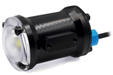
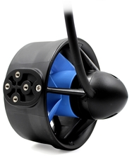

ASUQTR Actuator Node
====================

A ROS node for ASUQTR controlling PWM actuators via I2C on Nvidia Jetson Xavier.

You can find documentation for this node [here](https://wiki.asuqtr.com/en/Software/Specifications/ROS-Actuator-Node-Specifications)

This package serves the purpose of :
* Listening for generic actuator commands in simple format like **throttle percentage %**
* Enabling Jetson device's I2C drivers and starting communication with the PCA9685 chip
* Listening for **Kill Switch** events on the ROS network to reset the motors electronic 
  speed controller's boot sequence
* Highly abstracting actuator hardware by using Adafruits Servo classes

## Requirements:
1. A Nvidia Jetson device with ROS for ASUQTR installed:
[How to Install ROS for ASUQTR](https://confluence.asuqtr.com/display/SUBUQTR/How+to+install+ROS+for+ASUQTR)
2. A PCA9685 connected via I2C
3. (_Optional_) T200 Thrusters' drives plugged to the PCA's pwm channels

## Build:
Go to the node folder inside your catkin workspace and use catkin tools to build the ASUQTR actuator ros package:
<pre><code>cd ~/catkin_ws/src/asuqtr_actuator_node
catkin build asuqtr_actuator_node</code></pre>
_Note: Do not use the catkin_make tool. The ASUQTR ROS environment is not configured to use it correctly_

Even though the source code is written in python language, ROS still needs to build the package __at least once__ before
it can be executed. There is no need to rebuild the package if only python code is changed.

_However_,

If **a new ROS message, service or action** (a new .msg .srv or .action file in msg/, srv/, action/ folder) is created, 
**a new build is needed**. If not, the python source code cannot find the added message/srv/action module.

After a successful build, the new package must be loaded into the environment with :
<pre><code>source ~/catkin_ws/devel/setup.bash </code></pre>

_Old Developer Wisdom: Thou shall configure thy IDE to automate the sourcing of thy environment after a build_

## Run:
### With the whole ASUQTR system:
Add the __actuator_node.launch__ file inside an ASUQTR global system ROS launch file
<pre><code> &lt include file="$(find asuqtr_actuator_node)/launch/actuator_node.launch"/> </code></pre>
**Ctrl+C** to quit

### As a standalone ROS node for debugging
On a terminal, start the ros master process:
<pre><code>roscore</code></pre>
Then, in your IDE, you can use the python interpreter to run the **actuator_node.py** file in debug mode with
breakpoints and such features

It is possible to publish on topics this node subscribes to, for example:
<pre><code>rostopic pub /grippers ActuatorThrottle PRESS TAB TO AUTOCOMPLETE MSG FORMAT </code></pre>

_Old Developer Wisdom: Thou shall only type rostopic pub /motors then press TAB 2-3 times to automatically format thy 
msg structure_

### ROS parameters
This node shall be configured before runtime with the **/params/standard_setup.yaml**
file. This file contains many useful parameters such as PCA chip parameters (i2c address, ref clock speed,
pwm frequency) and PWM offset for motors if need be.

### Useful scripts
The /scripts folder contains a configuration script **tune_pca.py**. This file can be used
to determine experimentally what is the reference clock of your PCA chip, since it may slightly differ from
chip to chip. You need an oscilloscope to get results with the script.

### Useful ressources
* The [github page and source code](https://github.com/adafruit/Adafruit_Python_PCA9685) for adafruit's PCA9685 python 
  library
* The [github page and source code](https://github.com/adafruit/Adafruit_CircuitPython_Motor) for adafruit's motor 
  python library

## Proprietary License
Copyright (c) 2021 ASUQTR <asuqtr2018@gmail.com>