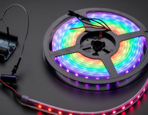

# ASUQTR ROS Indicator Node

An ASUQTR ROS node to control WS2812b LED strips on a SPI interface(see /doc folder for datasheet).

With the help of Adafruit python drivers, a ROS topic is added on the ASUQTR ROS network to command the color 
and pattern of the LEDs. A thread executes the pattern/color commands while another listens for commands. This 
is especially useful when used in conjunction 
with specific autonomous behaviors, since the visual feedback can tell sooner if a mission or behavior failed
while it was not supposed to.

## Requirements:
1. Nvidia Jetson device with ROS for ASUQTR installed:
[How to Install ROS for ASUQTR](https://confluence.asuqtr.com/display/SUBUQTR/How+to+install+ROS+for+ASUQTR)
2. Package dependencies. Run the install script :
    <pre><code> ./scripts/install_dependencies.sh </code></pre>
    _Note: The ASUQTR ROS installation should have taken care of this already_
3. Enabled SPI pins on the Jetson device. Run the setup script
       <pre><code>sudo /opt/nvidia/jetson-io/jetson-io.py</code></pre>
       i. Select **Configure 40-pin expansion header**  
       ii. Select **spi1 (19, 21, 23, 24, 26)** 
       iii. Select **Save and reboot to reconfigure pins**
4. NeoPixel LEDs plugged on the correct GPIO header of a Jetson device
5. Enough battery power to supply the LEDs (see datasheet)

## Build:
Go to the node folder inside your catkin workspace and use catkin tools to build the ASUQTR indicator ros package:
<pre><code>cd ~/catkin_ws/src/asuqtr_indicator_node
catkin build asuqtr_indicator_node</code></pre>
_Note: Do not use the catkin_make tool. The ASUQTR ROS environment is not configured to use it correctly_

Even though the source code is written in python language, ROS still needs to build the package __at least once__ 
before it can be executed. There is no need to rebuild the package if only python code is changed.

_However_,

If **a new ROS message, service or action** (a new .msg .srv or .action file in msg/, srv/, action/ folder) is created, 
**a new build is needed**. If not, the python source code cannot find the added message/srv/action module.

After a successful build, the new package must be loaded into the environment with :
<pre><code>source ~/catkin_ws/devel/setup.bash </code></pre>

_Old Developer Wisdom: Thou shall configure thy IDE to automate the sourcing of thy environment after a build_

## Run:
### With the whole ASUQTR system:
Call the __indicator_node.launch__ file  inside an ASUQTR global system ROS launch file
<pre><code> &lt include file="$(find asuqtr_indicator_node)/launch/indicator_node.launch"/> </code></pre>
**Ctrl+C** to quit

### As a standalone node for debugging
On a terminal, start the ros master process:
<pre><code>roscore</code></pre>
Then, in your IDE, you can use the python interpreter to run the **indicator_node.py** file in debug mode with
breakpoints and such features

It is possible to publish LED commands to topics in this node by typing :
<pre><code>rostopic pub /indicator/led_command LedCommand ... press TAB to auto complete the msg format </code></pre>

_Old Developer Wisdom: Thou shall only type rostopic pub /io then press TAB 2-3 times to automatically format thy 
msg structure_

## Proprietary License
Copyright (c) 2021 ASUQTR <asuqtr2018@gmail.com>