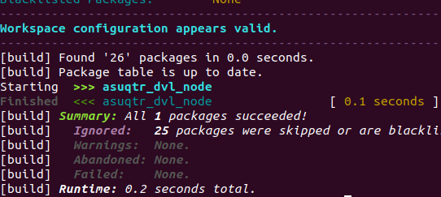
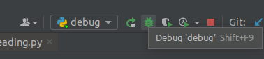

# ASUQTR ROS IO Node

An ASUQTR ROS node to control GPIO of Nvidia Jetson Xavier's 40 pin header.

You can find the documentation for this node [here](https://wiki.asuqtr.com/en/Software/Specifications/ROS-IO-Node-Specifications)

This package serves the purpose of tightly decoupling GPIO hardware modules. This is achieved by clearly defined
classes which represent hardware components such as simple digital IO sensors or actuators.
These classes can further be subclassed to add ROS network functionalities, thus improving the
separation of concerns and code maintenance over the life of this university project.

## Requirements:
1. An Nvidia Jetson device with ROS for ASUQTR installed:
[How to Install ROS for ASUQTR](https://confluence.asuqtr.com/display/SUBUQTR/How+to+install+ROS+for+ASUQTR)
2. Package dependencies. Run the install script :
    <pre><code> ./scripts/install_dependencies.sh</code></pre>
    _Note: The ASUQTR ROS installation should have taken care of this already_

3. Digital IO hardware for testing, for example : _Leak sensor, Fan, OE pin from a chip, magnetic switch_

## Build:
Go to the node folder inside your catkin workspace and use catkin tools to build the ASUQTR IO ros package:
<pre><code>cd ~/catkin_ws/src/asuqtr_io_node
catkin build asuqtr_io_node</code></pre>
_Note: Do not use the catkin_make tool. The ASUQTR ROS environment is not configured to use it correctly_

Even though the source code is written in python language, ROS still needs to build the package __at least once__ before
it can be executed. There is no need to rebuild the package if only python code is changed.

_However_,

If **a new ROS message, service or action** (a new .msg .srv or .action file in msg/, srv/, action/ folder) is created, 
**a new build is needed**. If not, the python source code cannot find the added message/srv/action module.

After a successful build, the new package must be loaded into the environment with :
<pre><code>source ~/catkin_ws/devel/setup.bash </code></pre>

_Old Developer Wisdom: Thou shall configure thy IDE to automate the sourcing of thy environment after a build_

## Run:
### With the whole ASUQTR system:
Add the __io_node.launch__ file inside an ASUQTR global system ROS launch file
<pre><code> &lt include file="$(find asuqtr_io_node)/launch/io_node.launch"/> </code></pre>
**Ctrl+C** to quit

### As a standalone ROS node for debugging
On a terminal, start the ros master process:
<pre><code>roscore</code></pre>
Then, in your IDE, you can use the python interpreter to run the **io_node.py** file in debug mode with
breakpoints and such features

It is possible to publish or listen to topics in this node by typing, for example:
<pre><code>rostopic echo /io/kill_switch 
rostopic pub /io/disable_motors_pwm Bool "data: true" </code></pre>

_Old Developer Wisdom: Thou shall only type rostopic pub /io then press TAB 2-3 times to automatically format thy 
msg structure_

## Proprietary License
Copyright (c) 2021 ASUQTR <asuqtr2018@gmail.com>